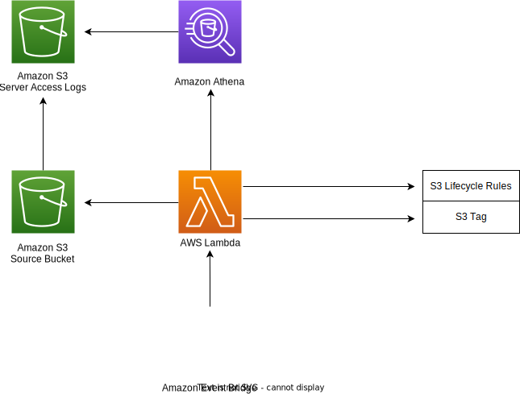

# Develeap Bucket Optimizer
## Intro

If you wanted to optimize the storage costs in your S3 bucket by using AWS S3 Intelligent-Tiering, but you encountered an obstacle related to the size of your objects, which need to be at least 128KB in size, don't worry, because you have come to the right place

Bucket Optimizer was created with the idea of reducing cases related to the inability to optimize the storage costs of objects due to their inappropriate size. The mechanism involves moving an object from S3 Standard to S3 Standard-IA class if certain conditions are met. In our case, these conditions will include an arbitrary number of days during which the object should not be modified, and a second declarative number indicating the number of days for which the object has not been accessed.

## Architecture

This project was created as a solution for this type of problem. The original proposal was slightly different in terms of the components in the flow, which can be found here:

https://aws.amazon.com/blogs/architecture/expiring-amazon-s3-objects-based-on-last-accessed-date-to-decrease-costs/

**The current architecture is represented in the diagram below:**




**The entire architecture consists of:**

- **Amazon S3 Source Bucket** (Our target bucket where the changes will be introduced)
- **Amazon S3 Server Access Logs** (A bucket for storing server access logs)
- **Amazon Athena** (An Amazon Athena query is run against the Amazon S3 Server Access Logs to verify whether the condition with the accessed time was met)
- **AWS Lambda** (A Lambda function executes a Python script to tag appropriate objects. Tagging objects triggers S3 Lifecycle Rules)
- **Amazon EventBridge** (An Amazon EventBridge rule is configured to periodically invoke the Lambda function)

## Structure Of The Repository
```
├── data.tf
├── images
│   └── newdiagram.drawio.svg
├── LICENSE
├── main.tf
├── modules
│   ├── optimize
│   │   ├── athena.tf
│   │   ├── cloudwatch_event.tf
│   │   ├── lambda.tf
│   │   ├── local.tf
│   │   ├── outputs.tf
│   │   └── variables.tf
│   └── origin_resources
│       ├── lifecycle.tf
│       ├── server_log_bucket.tf
│       └── variables.tf
├── providers.tf
├── README.md
├── scripts
│   └── optimizer_lambda.py
└── variables.tf
```
Our repository is organized into logically divided modules, named **optimize** and **origin_resources**. In the **origin_resources** module, we provision Amazon S3 Server Access Logs with S3 Lifecycle Rules based on the Amazon S3 Source Bucket. In the **optimize** module, we create all the resources actively used in the optimization process, including Amazon CloudWatch Events, AWS Lambda, and Amazon Athena. The **scripts** folder contains the backbone of our implementation, which is a Python script.

## Main Goal

The main objective we want to accomplish is performing a transition from **S3 Standard** to **S3 Standard-IA**. The transition is executed when predetermined conditions are met. Our conditions are:

- The object hasn't been accessed in the last 30 days.
- The object hasn't been modified in the last 30 days.

The number of days specified in each condition is arbitrary and can be changed in the **variables.tf** (input variables) file according to our preferences:

- **modify_days** (The object hasn't been modified in the last X days)
- **access_days** (The object hasn't been accessed in the last Y days)

## Variables

Set of input variables needed to run the project:
```
variable "region" {
  description = "AWS Region"
  type        = string
  default     = "us-east-1"
}
```
```
variable "aws_account_id" {
  description = "AWS account ID"
  type        = string
  default     = "006262944085"
}
```
```
variable "source_bucket" {
  description = "Amazon S3 Source Bucket, where the transition will be done"
  type        = string
  default     = "gilad-optimizer-test-files-bucket"
}
```
```
variable "modify_days" {
  description = "Arbitrary value for condition regarding modifying the object"
  type        = string
  default     = "30"
}
```
```
variable "access_days" {
  description = "Arbitrary value for condition regarding accessing the object"
  type        = string
  default     = "30"
}
```
```
variable "lambda_function_name" {
  description = "Name of the lambda function"
  type        = string
  default     = "bucket-optimizing-lambda"
}
```
```
variable "athena_database_name" {
    description = "Name of the athena database"
    type        = string
    default     = "dbdb"
}
```
```
variable "athena_table_name" {
    description = "Name of the athena table"
    type        = string
    default     = "testtest"
}
```
```
variable "cloudwatch_rule_name" {
    description = "Name of the cloudwatch rule"
    type        = string
    default     = "lambda_event_rule"
}
```
```
variable "cloudwatch_rule_description" {
    description = "Description of the cloudwatch rule"
    type        = string
    default     = "Schedules periodically"
}
```
```
variable "cloudwatch_rule_schedule_expression" {
    description = "Frequency of running the lambda function"
    type        = string
    default     = "rate(2 minutes)" 
}
```
```
variable "target_prefix" {
    description = "Prefix for all log object keys"
    type        = string
    default     = "log/"
}
```
```
variable "log_bucket_name" {
    description = "Name of the bucket for server access logs"
    type        = string
    default     = "bucket-optimize-logs"
}
```
```
variable "log_bucket_acl" {
    description = "S3 Bucket ACL resource"
    type        = string
    default     = "log-delivery-write"
}
```
```
variable "athena_queries_destination" {
    description = "Name of the destination in S3 bucket for athena queries"
    type        = string
    default     = "athena"
}
```
```
variable "key" {
    description = "Key for tagging the object"
    type        = string
    default     = "demo"
}
```
```
variable "value" {
    description = "Value for tagging the object"
    type        = string
    default     = "demo"
}
```

## Credits and legal ownership

*The Bucket Optimizer AWS project is owned by **Develeap** ([MIT License](/LICENSE))*


